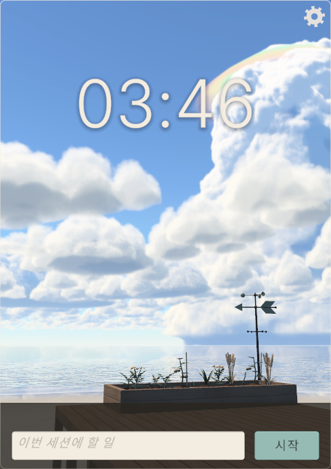
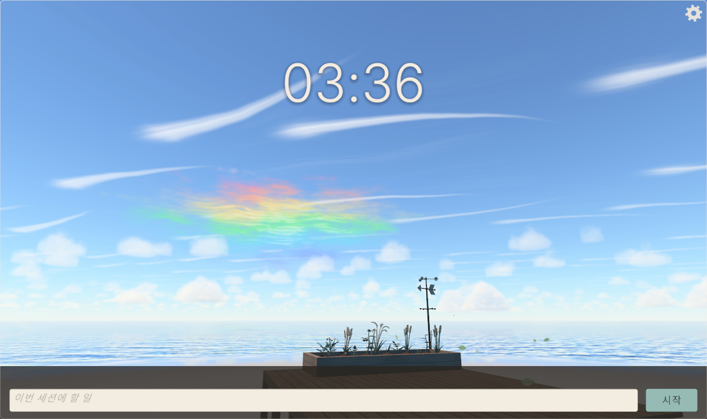
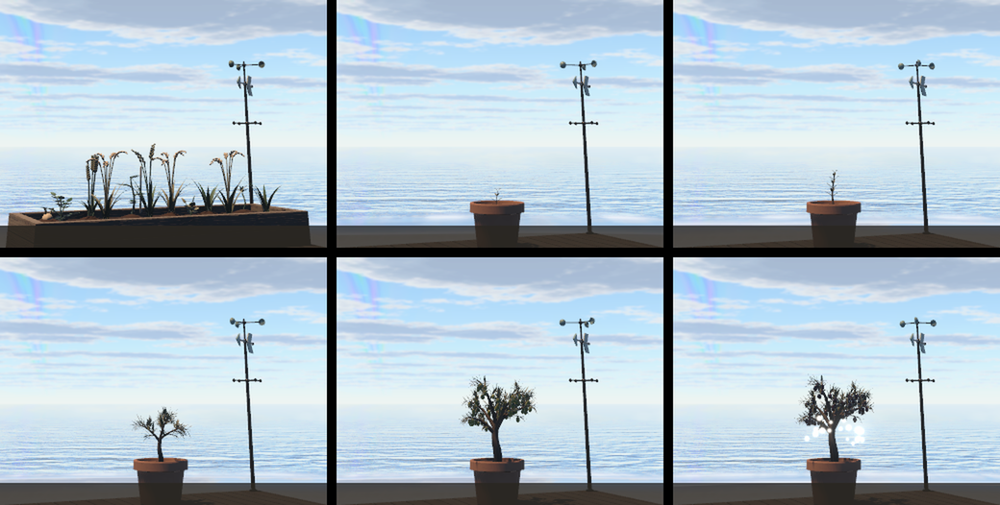

# SAIUN · 彩雲

하늘을 올려다보며 집중하는 Windows용 포모도로 데스크톱 위젯.

바닷가 나무 데크에 놓인 작은 텃밭 너머로, 실시간으로 계산해 그린 하늘이 흘러갑니다.
가끔 웅대적운이 솟아오르고, 운이 좋으면 무지갯빛 구름 채운(彩雲, *saiun*)이 뜹니다.

> [!IMPORTANT]
> **완전 바이브 코딩(vibe coding) 프로젝트입니다.**
> 이 저장소의 C# 코드, 하늘 셰이더(GLSL/HLSL), 코드로 빚은 3D 모델, 테스트, 커밋 메시지, 그리고 이 README까지
> **모두 AI(Anthropic의 Claude · Claude Code)가 작성했습니다.**
> 사람은 기획서와 방향, 취향, 피드백을 주었고,
> 코드를 직접 짜지 않았습니다. 동작은 자동 테스트(PlayMode 238개)와 실제 실행 화면으로 확인했습니다.

| 웅대적운과 채운 갓구름 | 창을 넓히면 초광각처럼 더 넓게 |
| :---: | :---: |
|  |  |



*쉬는 동안의 텃밭 → 집중을 시작하면 토분에 심는 올리브 → 세션 진행만큼 자라 열매가 익는다.*

## 무엇을 하나요

- **포모도로** — 집중·짧은 휴식·긴 휴식과 세트 수를 정해 시작합니다. 집중 중에 등록해 둔 방해 앱으로 넘어가면
  유예 시간 안에 돌아와야 하고, 돌아오지 않으면 세션이 실패합니다.
- **하늘** — 레일리·미 산란과 오존 흡수로 셈한 하늘빛 위에, 레이마칭으로 그린 부피 구름이 뜹니다.
  권운·권적운·권층운·고적운·고층운·층적운·층운·난층운·뭉게구름·꼬리구름·야광운·렌즈구름·아치구름·
  유방운·구멍구름·물결구름(켈빈-헬름홀츠)·적란운 모루, 그리고 드물게 솟는 **웅대적운**. 구름층마다 다른 바람에 흘러갑니다.
- **채운** — 하늘 상태에 어울리게 세 모양(가로로 선 너울, 비스듬히 흐르는 비단 띠, 해 둘레 조각)으로 뜨고,
  웅대적운 꼭대기에는 무지갯빛 갓구름이 씌워집니다.
- **시간** — 집중 세션의 진행이 하루(아침 → 한낮 → 노을)가 되고, 휴식에는 노을과 박명이 집니다.
  쉬는 동안의 시계 화면 하늘은 고른 도시의 실제 해·달을 따르거나 하루를 천천히 돕니다. 밤에는 별과 달이 뜹니다.
- **바다** — 지평선 아래는 하늘을 비추는 바다와 모래밭입니다. 윤슬과 파도, 바람에 따라 바뀌는 물결.
- **정원** — 쉬는 동안 나무 상자의 텃밭(쌀·밀·토마토·감자)이 실제 시각을 따라 한 시간 주기로 저절로 자랍니다.
  집중을 시작하면 상자가 토분으로 바뀌어 올리브 한 그루를 심고, 세트를 마칠수록 자라 열매가 익습니다. 실패하면 시듭니다.
- **날씨** — 비와 바람, 바람을 읽는 풍향계·풍속계. 집중이 흔들리면 먹구름이 몰려옵니다.
- **창** — 테두리 없는 카드(기본 480×680) 또는 화면 오른쪽에 붙는 사이드바. 가장자리를 끌어 크기를 바꾸면
  그림을 늘리지 않고 초광각 렌즈처럼 더 넓게 봅니다. 항상 위에 둘 수 있고, OBS·스크린샷에 그대로 잡힙니다.
- **기록** — 세션과 수확을 SQLite에 남기고, 설정 화면에서 누적 집중 시간과 수확을 봅니다.

## 요구 사항

- Windows 10 / 11 (둥근 모서리 등 일부 창 효과는 Windows 11)
- Unity **6000.3.11f1** (URP)
- 하늘을 실시간으로 계산하므로 GPU를 꽤 씁니다(개발 환경 RTX 5070 Ti). 하늘은 0.1초마다 1/8씩 나눠 그리고,
  큰 창에서는 하늘 텍스처에 화소 수 상한(80만)을 둡니다.

## 빌드·실행

1. Unity Hub에서 6000.3.11f1로 프로젝트를 엽니다.
2. 메뉴 **SAIUN → Setup Main Scene** 으로 씬을 조립합니다(설정 화면은 **SAIUN → Rebuild Settings UI**).
3. 메뉴 **SAIUN → Build Windows Player** 로 `Build/Windows/SAIUN.exe` 를 만듭니다.

배치 모드(에디터를 닫은 상태):

```bat
"C:\Program Files\Unity\Hub\Editor\6000.3.11f1\Editor\Unity.exe" -batchmode -projectPath . -quit ^
  -executeMethod _SAIUN.Editor.SaiunPlayerBuilder.BuildWindows -logFile build.log
```

## 테스트

Test Runner의 **PlayMode** 테스트(238개)입니다.

```bat
"C:\Program Files\Unity\Hub\Editor\6000.3.11f1\Editor\Unity.exe" -batchmode -projectPath . ^
  -runTests -testPlatform PlayMode -testResults results.xml -logFile tests.log
```

## 구조

```
Assets/_SAIUN/
  Scripts/      Core(상태머신·창·게임 매니저)  Timer  Weather(하늘·날씨)  Crop(텃밭·올리브)
                Lighting(해·달)  Data(SQLite·설정)  Distraction(방해 앱)  UI
  Editor/       씬·설정 UI·작물·풍향계·나무 결을 코드로 조립하는 생성기, 빌드
  Art/Shaders/  Sky.shader — 하늘·바다 셰이더(생성물, 직접 고치지 않는다)
  Tests/        PlayMode 테스트
Tools/SkyLab/   하늘 셰이더 원본(GLSL), WebGL 시안 실험실, HLSL 변환기
Tools/Fonts/    Sarasa Gothic 부분 글꼴 만들기
```

## 하늘 셰이더 고치기

하늘은 `Tools/SkyLab` 의 GLSL이 원본이고, Unity의 `Sky.shader` 는 거기서 만들어 냅니다.

1. `sky_common.glsl`(하늘), `sea_common.glsl`(바다·보이는 장), `light_common.glsl`, `view_common.glsl` 을 고칩니다.
2. `python build.py` 로 시안 페이지(`sky.html`)를 만들고, `python server.py` 를 띄운 뒤
   브라우저에서 `http://127.0.0.1:8765/runner.html` 을 열면 `variants.txt` 의 줄마다 그려 `out/` 에 저장합니다.
3. `python to_hlsl.py` 로 `Assets/_SAIUN/Art/Shaders/Sky.shader` 를 다시 만듭니다.

함정: `fract(sin(x) * 43758)` 꼴 해시는 쓰지 않습니다(큰 인자에서 GPU마다 값이 흔들려 하늘에 빗살이 섭니다).
HLSL에는 `mod` 가 없어 각도 차는 `AngleDelta` 로 셈하고, `patch`·`flat` 같은 GLSL 예약어는 이름으로 쓰지 않습니다.

## 데이터와 개인정보

- 앱은 화면을 읽지 않습니다. 방해 앱 감지는 맨 앞 창의 프로세스 이름만 봅니다. 네트워크도 쓰지 않습니다.
- 기록은 `%USERPROFILE%\AppData\LocalLow\DefaultCompany\SAIUN\saiun.db`, 방해 앱 목록은 같은 폴더의 `blacklist.json`,
  설정은 레지스트리(`HKCU\Software\DefaultCompany\SAIUN`)에 있습니다.

## 글꼴

- [Sarasa Gothic](https://github.com/be5invis/Sarasa-Gothic) K — SIL Open Font License 1.1. 앱에 쓰는 글자만 남긴 부분 글꼴이며,
  빌드 폴더에 `Licenses/SarasaGothic-OFL.txt` 가 함께 들어갑니다.
- 그 밖의 글자는 Windows의 맑은 고딕·Yu Gothic으로 대체합니다.
